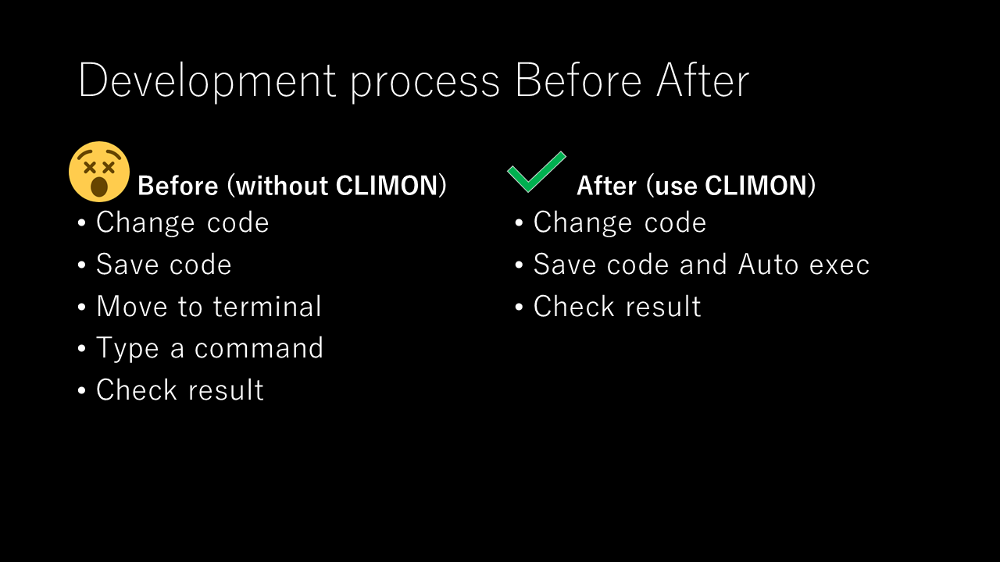

CLIMON
======

[nodemon](https://github.com/remy/nodemon) にインスピレーションを得たファイルの変更に伴って任意のコマンドを実行するユーティリティツールです。

インストール
------------

Goで書かれており、依存関係なくダウンロードしてすぐ使えます。
リリースタグを参照してください。

使い方とデモンストレーション
-------------------------


```shell
climon -path='./tmp' -- echo Changed
```

例:Go言語でCLIを開発しているときに

```shell
climon -path='./' -- go run main.go
```

例:`create-ink-app` で CLIを開発しているときに

```bash
create-ink-app my-app
climon -path='./' -- my-app
```

ファイルの変更を検知すると 指定したコマンドを自動的に実行するので、動作を確認しながら開発するのが便利になります。

| 引数名                | 必須 | 説明                                               | デフォルト                          |
| --------------------- | ---- | -------------------------------------------------- | ----------------------------------- |
| -path                 | Yes  | 監視ディレクトリ                                   | "" (指定しない場合エラーになります) |
| -err                  | No   | true:エラーを出力する/false:エラーを出力しない     | true                                |
| -stdo                 | No   | true:標準出力を出力する/false:標準出力を出力しない | true                                |
| -- \<command arg...\> | No   | 変更を検知したときに実行する処理                   | true                                |

作成動機
-------

このツールは、別のプロジェクトのCLIを開発中に何度も 手動で テスト実行していて WEB開発の時の `nodemon` や `create-react-app` のホットリロード機能が欲しくなったことが理由です。


